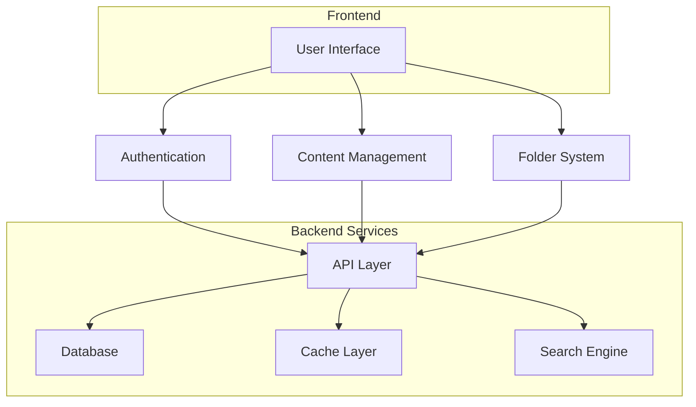

# System Architecture

## Overview

AIScout is built with a modern, scalable architecture focusing on performance, security, and user experience.



## Core Systems

### [Authentication](/docs/architecture/auth.md)

- User authentication and authorization
- OAuth integration
- Session management
- Security measures

### [Content Management](/docs/architecture/content.md)

- Content types and processing
- Search functionality
- Caching strategy
- Performance optimization

### [Folder System](/docs/architecture/folders.md)

- Folder organization
- Sharing capabilities
- Content management
- State management

## Technical Stack

### Frontend

- Next.js 13+ (App Router)
- TypeScript
- Zustand
- Tailwind CSS
- shadcn/ui
- Testing Library

### Backend

- Node.js
- PostgreSQL
- Redis Cache
- Elasticsearch
- JWT Auth

## Design Principles

### 1. Performance First

- Optimistic updates
- Efficient caching
- Lazy loading
- Code splitting

### 2. Type Safety

- TypeScript throughout
- Runtime validation
- API type generation
- Strict type checking

### 3. Security

- Authentication
- Authorization
- Data validation
- Security headers

### 4. User Experience

- Fast interactions
- Error handling
- Loading states
- Accessibility

## Development Workflow

### Local Development

```bash
# Start development environment
npm run dev

# Run type checking
npm run type-check

# Run tests
npm run test
```

### Deployment

```bash
# Build application
npm run build

# Run production build
npm start
```

## System Integration

### API Integration

```typescript
interface APIConfig {
  baseURL: string;
  timeout: number;
  retries: number;
  headers: {
    "Content-Type": string;
    Authorization?: string;
  };
}
```

### Error Handling

```typescript
interface ErrorResponse {
  code: string;
  message: string;
  details?: unknown;
}
```

## Monitoring

### Key Metrics

- Response times
- Error rates
- Cache hit rates
- API usage
- User engagement

### Logging

- Error tracking
- Performance monitoring
- User analytics
- Security events

## Testing Strategy

### Unit Testing

- Components
- Utilities
- Store logic
- API clients

### Integration Testing

- API integration
- Component interaction
- State management
- Error scenarios

### E2E Testing

- User flows
- Critical paths
- Performance
- Security

## Documentation

### Code

- TypeScript types
- JSDoc comments
- README files
- Architecture docs

### API

- OpenAPI spec
- Route documentation
- Type definitions
- Examples

## Future Roadmap

### Short Term

- Performance optimization
- Enhanced security
- Better error handling
- Improved testing

### Long Term

- Microservices
- Real-time features
- ML integration
- Analytics platform
