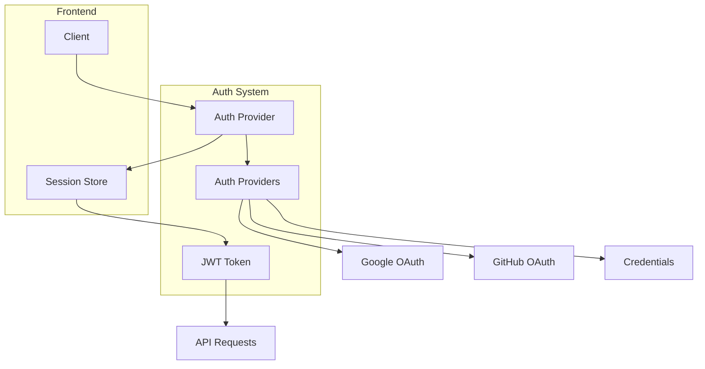
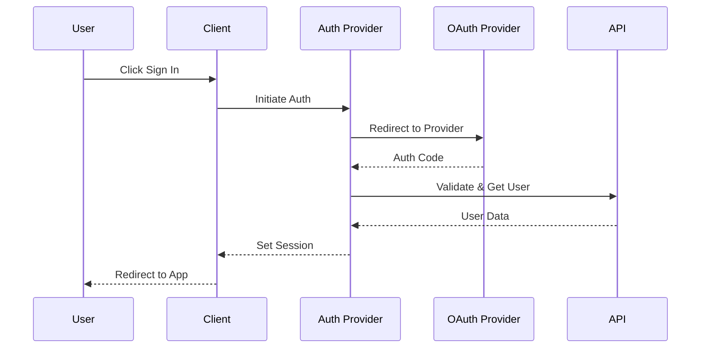

# Authentication Architecture

## System Overview



## Authentication Flow



## Technical Implementation

### Authentication Provider

```typescript
// auth/config.ts
export const authConfig: AuthOptions = {
  providers: [
    GoogleProvider({...}),
    GitHubProvider({...}),
    CredentialsProvider({...})
  ],
  session: {
    strategy: "jwt",
    maxAge: 30 * 24 * 60 * 60 // 30 days
  },
  callbacks: {
    async session({ session, token }) {...},
    async jwt({ token, user }) {...}
  }
}
```

## Security Measures

### Session Management

- JWT-based sessions
- Secure HTTP-only cookies
- CSRF protection
- Session rotation

### Password Security

- Bcrypt hashing
- Salt rounds configuration
- Password strength validation
- Rate limiting on attempts

### OAuth Security

- State parameter validation
- PKCE for OAuth 2.0
- Secure callback handling
- Scope restrictions

## Error Handling

### Authentication Errors

```typescript
type AuthError =
  | "CredentialsSignin"
  | "OAuthSignin"
  | "OAuthCallback"
  | "OAuthCreateAccount"
  | "EmailCreateAccount"
  | "SessionRequired";

interface AuthErrorHandler {
  error: AuthError;
  message: string;
  action: () => void;
}
```

## Middleware

### Protection

```typescript
// middleware.ts
export const config = {
  matcher: ["/folders/:path*", "/api/folders/:path*", "/settings/:path*"],
};

export async function middleware(req: NextRequest) {
  const token = await getToken({ req });
  if (!token) {
    return NextResponse.redirect(new URL("/sign-in", req.url));
  }
}
```

## User Management

### User Types

```typescript
interface User {
  id: string;
  email: string;
  name?: string;
  image?: string;
  emailVerified?: Date;
  accounts: Account[];
  sessions: Session[];
}

interface Account {
  provider: string;
  type: string;
  providerAccountId: string;
  access_token?: string;
  expires_at?: number;
  refresh_token?: string;
}
```

## API Integration

### Authentication Headers

```typescript
interface AuthHeaders {
  Authorization: `Bearer ${string}`;
  "X-CSRF-Token": string;
}
```

### Protected Routes

```typescript
// Example protected API route
export async function GET(req: Request) {
  const session = await getSession();
  if (!session) {
    return new Response("Unauthorized", { status: 401 });
  }
  // Handle request
}
```

## Monitoring

### Security Events

- Failed login attempts
- Password resets
- Account lockouts
- Session invalidations
- OAuth errors

### Metrics

- Active sessions
- Login success rate
- Provider usage
- Error rates
- Response times

## Testing

### Unit Tests

- Authentication flows
- Token validation
- Password hashing
- Error handling

### Integration Tests

- OAuth providers
- Session management
- API authentication
- Error scenarios

### Security Tests

- CSRF protection
- XSS prevention
- Session handling
- Rate limiting

## Future Improvements

### Features

- Multi-factor authentication
- SSO integration
- Password-less auth
- Biometric authentication
- Session management UI

### Security

- Audit logging
- IP-based blocking
- Fraud detection
- Security headers
- CSP configuration
