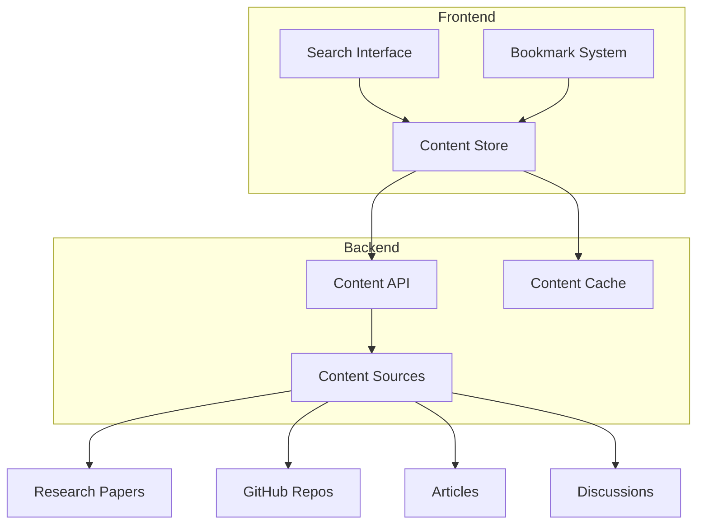
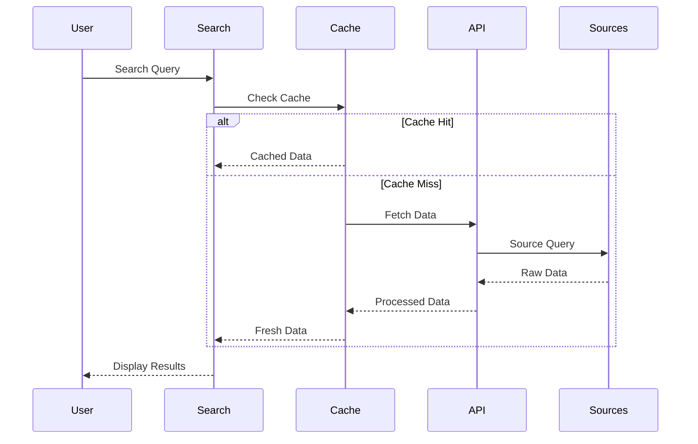
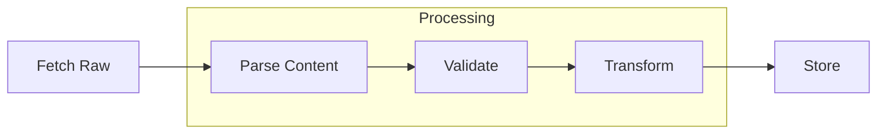

# Content Management Architecture

## System Overview



## Content Types

### Research Papers

```typescript
interface Paper {
  id: string;
  title: string;
  abstract: string;
  authors: Author[];
  publishedDate: Date;
  doi?: string;
  citations: number;
  references: Reference[];
  keywords: string[];
  fullText?: string;
}
```

### GitHub Repositories

```typescript
interface Repository {
  id: string;
  name: string;
  description: string;
  owner: string;
  language: string;
  stars: number;
  forks: number;
  lastCommit: Date;
  topics: string[];
  readme?: string;
}
```

### Articles & Discussions

```typescript
interface Article {
  id: string;
  title: string;
  content: string;
  author: Author;
  publishedDate: Date;
  tags: string[];
  source: string;
  url: string;
}

interface Discussion {
  id: string;
  title: string;
  content: string;
  author: Author;
  replies: Reply[];
  tags: string[];
  votes: number;
}
```

## Data Flow

### Content Fetching



## Search System

### Query Processing

```typescript
interface SearchQuery {
  term: string;
  filters: {
    type?: ContentType[];
    date?: DateRange;
    tags?: string[];
    language?: string[];
  };
  sort: {
    field: string;
    order: "asc" | "desc";
  };
  pagination: {
    page: number;
    limit: number;
  };
}
```

### Search Features

- Full-text search
- Faceted filtering
- Relevance scoring
- Auto-suggestions
- Recent searches
- Popular queries

## Caching Strategy

### Cache Levels

1. Browser Cache

   - Search results
   - Content metadata
   - User preferences

2. API Cache

   - Frequent queries
   - Popular content
   - Aggregated data

3. Source Cache
   - Raw content
   - External API responses
   - Parsed documents

### Cache Invalidation

- Time-based expiry
- Version tagging
- Manual purge
- Dependency tracking

## Content Processing

### Pipeline



### Features

- Metadata extraction
- Content sanitization
- Format conversion
- Link validation
- Image processing

## Performance

### Optimization

- Lazy loading
- Progressive loading
- Image optimization
- Content compression
- Response streaming

### Metrics

- Load time
- Time to interactive
- Cache hit rate
- API latency
- Error rate

## Content Security

### Measures

- Content validation
- XSS prevention
- Link scanning
- Image scanning
- Rate limiting

### Access Control

- Content permissions
- User roles
- API keys
- Usage quotas

## Testing

### Content Tests

- Format validation
- Content integrity
- Metadata accuracy
- Link validation

### Performance Tests

- Load testing
- Cache efficiency
- API response time
- Search performance

### Security Tests

- Content injection
- Access control
- Rate limiting
- Data validation

## Future Improvements

### Features

- Advanced search
- Content recommendations
- Personalization
- Social features
- Analytics

### Technical

- Real-time updates
- Content versioning
- Collaborative features
- ML-powered search
- Content clustering
