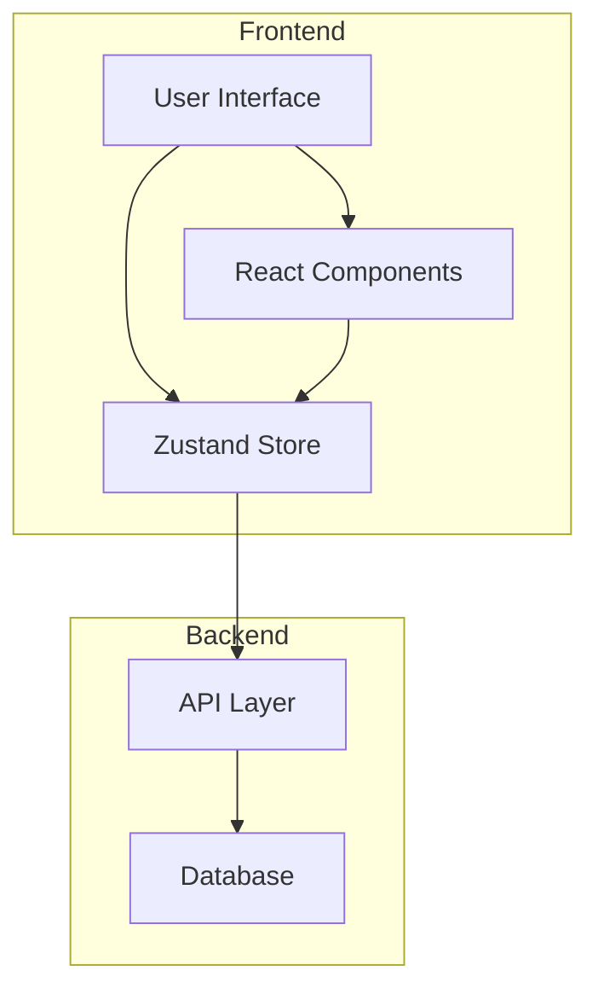
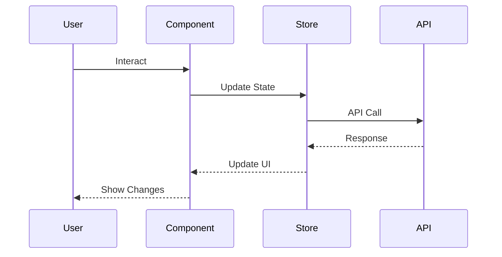

# Folder System Architecture

## System Overview



## Technical Stack

### Frontend

- Next.js 13+ with App Router
- TypeScript
- Zustand for state management
- Tailwind CSS for styling
- shadcn/ui component library
- @dnd-kit for drag and drop

### Backend Integration

- REST API
- JWT authentication
- Rate limiting
- Optimistic updates

## Data Flow

### State Management



## Performance Considerations

### Client-Side

- Optimistic updates for better UX
- Debounced API calls for reordering
- Lazy loading of folder contents
- Caching strategies

### API

- Rate limiting
- Request batching
- Response compression
- ETags for caching

## Security

### Authentication

- JWT-based auth
- Session management
- CSRF protection

### Authorization

- Role-based access control
- Granular sharing permissions
- API endpoint protection

## Error Handling

### Strategy

1. Client-side validation
2. API error handling
3. User feedback
4. Recovery mechanisms

### Error Types

```typescript
type ErrorType =
  | "ValidationError"
  | "NetworkError"
  | "AuthError"
  | "PermissionError"
  | "ServerError";

interface ErrorHandler {
  type: ErrorType;
  message: string;
  recovery: () => void;
}
```

## Monitoring & Logging

### Client-Side

- Error tracking
- Performance monitoring
- User interactions
- Feature usage

### API

- Request/response logging
- Error tracking
- Performance metrics
- Rate limit monitoring

## Testing Strategy

### Levels

1. Unit Tests

   - Components
   - Store logic
   - Utilities

2. Integration Tests

   - Component interactions
   - Store + API
   - User flows

3. E2E Tests
   - Critical paths
   - User journeys
   - Error scenarios

### Coverage Goals

- Unit tests: 80%+
- Integration tests: 70%+
- E2E tests: Critical paths

## Deployment

### CI/CD Pipeline

1. Code quality checks
2. Type checking
3. Test execution
4. Build process
5. Deployment stages

### Environments

- Development
- Staging
- Production

## Future Considerations

### Scalability

- Nested folders
- Bulk operations
- Advanced sharing
- Real-time collaboration

### Performance

- Virtual scrolling
- Progressive loading
- Worker offloading
- Edge caching

### Features

- Version history
- Advanced search
- Folder analytics
- Export/import
